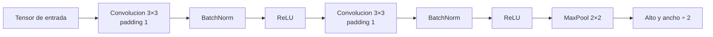

# Arquitectura de la CNN base

Esta es la arquitectura definida por `BreastPCRNet` en
`src/architectures.py`. No es un modelo descargado ni preentrenado: todas sus
capas y pesos se construyen en este proyecto.

## Recorrido visual

```mermaid
flowchart LR
    I["Entrada<br/>PRE · EARLY · LATE<br/><b>B × 3 × 256 × 256</b>"]
    B1["Bloque 1<br/>2 × Conv 3×3 + BN + ReLU<br/>MaxPool 2×2<br/><b>B × 16 × 128 × 128</b>"]
    B2["Bloque 2<br/>2 × Conv 3×3 + BN + ReLU<br/>MaxPool 2×2<br/><b>B × 32 × 64 × 64</b>"]
    B3["Bloque 3<br/>2 × Conv 3×3 + BN + ReLU<br/>MaxPool 2×2<br/><b>B × 64 × 32 × 32</b>"]
    B4["Bloque 4<br/>2 × Conv 3×3 + BN + ReLU<br/>MaxPool 2×2<br/><b>B × 128 × 16 × 16</b>"]
    GAP["Global Average Pooling<br/><b>B × 128 × 1 × 1</b>"]
    D["Flatten + Dropout 0,30<br/><b>B × 128</b>"]
    O["Linear 128 → 1<br/><b>B logits</b>"]

    I --> B1 --> B2 --> B3 --> B4 --> GAP --> D --> O
```



En Visual Studio Code, abre este archivo y pulsa `Cmd+Shift+V` en macOS o
`Ctrl+Shift+V` en Windows/Linux para abrir la vista previa y renderizar el
diagrama.

## Que contiene cada bloque

Cada bloque realiza este recorrido dos veces antes del pooling:



- Las convoluciones conservan alto y ancho porque usan kernel 3×3 y padding 1.
- El pooling reduce a la mitad las dimensiones espaciales.
- Los canales aumentan `3 → 16 → 32 → 64 → 128` para representar mas patrones.
- Los filtros de las convoluciones se aprenden durante el entrenamiento.
- La salida es un **logit**, no una probabilidad. `sigmoid(logit)` produce la
  probabilidad estimada de pCR.

## Dimensiones y parametros

| Etapa | Salida | Parametros entrenables |
|---|---:|---:|
| Entrada | `B × 3 × 256 × 256` | 0 |
| Bloque 1 | `B × 16 × 128 × 128` | 2.800 |
| Bloque 2 | `B × 32 × 64 × 64` | 13.952 |
| Bloque 3 | `B × 64 × 32 × 32` | 55.552 |
| Bloque 4 | `B × 128 × 16 × 16` | 221.696 |
| Global Average Pooling | `B × 128 × 1 × 1` | 0 |
| Dropout | `B × 128` | 0 |
| Linear | `B` | 129 |
| **Total** | | **294.129** |

Antes del promedio global, cada posicion del ultimo mapa tiene un campo
receptivo aproximado de 76×76 pixeles. El promedio global combina las 16×16
posiciones y permite que la decision use informacion distribuida por la imagen.

## Donde esta cada pieza

| Archivo | Responsabilidad |
|---|---|
| `src/architectures.py` | Define las capas de `BreastPCRNet`. |
| `configs/experiments/E02_base_normal.json` | Fija canales, dropout, batch, epocas y optimizador. |
| `src/data.py` | Carga PRE, EARLY y LATE como `[3, 256, 256]`. |
| `src/train.py` | Ejecuta forward, loss, backward, validacion y checkpoints. |
| `src/inspect_architecture.py` | Imprime la red y sus dimensiones sin entrenarla. |

## Que comando usar

Ver la arquitectura sin entrenar ni leer imagenes:

```bash
python -m src.inspect_architecture
```

Ensayo general corto con pocas pacientes:

```bash
python -m src.smoke_training
```

Entrenamiento completo E02 en la GPU:

```bash
python -m src.train \
  --config configs/experiments/E02_base_normal.json \
  --device cuda
```

El primer comando solo inspecciona. El segundo comprueba el pipeline. El tercero
es el que entrena la red completa y puede tardar bastante.
