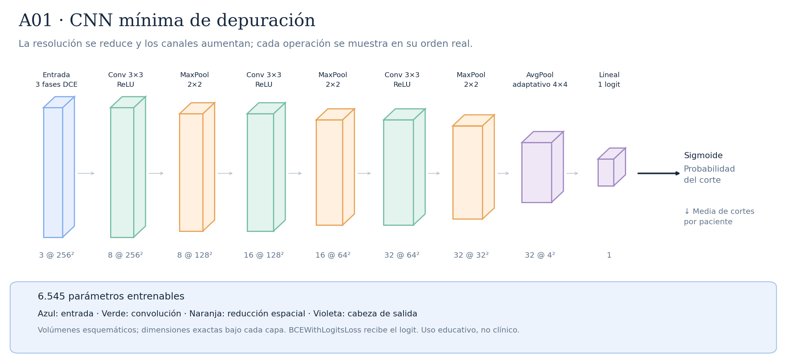

# A01 · CNN mínima de depuración



Tres bloques Conv–ReLU–Pool, canales 8/16/32. Resume a 4×4 y conecta 512 valores a un logit. Su objetivo fue memorizar un subconjunto pequeño para comprobar el cableado; no es una estimación de generalización.

Total: **6.545 parámetros entrenables**.

Configuraciones asociadas:

- [CNN mínima](../../src/model.py), utilizada por la prueba de memorización.

## Recorrido de las capas

| Operación | Salida por corte | Parámetros de la operación | Detalle |
|---|---|---:|---|
| Entrada · 3 fases DCE | `(3, 256, 256)` | 0 | 3 fases temporales |
| Conv 3×3 · ReLU | `(8, 256, 256)` | 224 | kernel=3, padding=1, stride=1 |
| MaxPool · 2×2 | `(8, 128, 128)` | 0 | kernel=2, padding=0, stride=2 |
| Conv 3×3 · ReLU | `(16, 128, 128)` | 1168 | kernel=3, padding=1, stride=1 |
| MaxPool · 2×2 | `(16, 64, 64)` | 0 | kernel=2, padding=0, stride=2 |
| Conv 3×3 · ReLU | `(32, 64, 64)` | 4640 | kernel=3, padding=1, stride=1 |
| MaxPool · 2×2 | `(32, 32, 32)` | 0 | kernel=2, padding=0, stride=2 |
| AvgPool · adaptativo 4×4 | `(32, 4, 4)` | 0 | salida espacial=(4, 4) |
| Flatten | `(512,)` | 0 | reorganiza; sin pesos |
| Flatten | `(512,)` | 0 | 32 × 4 × 4 = 512 valores |
| Lineal · 1 logit | `(1,)` | 513 | 512 → 1 |

Las formas omiten el batch `B`. Esta red no usa Batch Normalization.

Antes del promedio adaptativo, cada posición tiene un campo receptivo teórico de **22×22 píxeles**. El promedio combina posiciones espaciales; no equivale a localizar un tumor.

Las convoluciones tienen stride 1 y padding 1; cada MaxPool 2×2 tiene stride 2. ReLU aporta no linealidad. La sigmoide se aplica para evaluar, después del logit. La media de probabilidades por paciente es la agregación inicial, pendiente de selección con validación.

## Imágenes y regeneración

[SVG vectorial](arquitectura.svg) · [PNG](arquitectura.png). Las etiquetas y dimensiones se obtienen ejecutando la red con una entrada ficticia; no se leen imágenes de pacientes.

```bash
python -m src.document_architectures
```

Uso educativo y de investigación, sin validez clínica.
