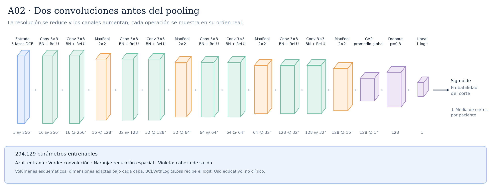

# A02 · Dos convoluciones antes del pooling



Cada bloque hace Conv–BN–ReLU → Conv–BN–ReLU → MaxPool. La hipótesis es combinar características antes de reducir resolución. E02 y E03 comparten esta arquitectura y cambian únicamente la pérdida. En el primer fold y semilla E02 obtuvo ROC-AUC 0,6204 y E03 0,6029; no basta para declarar una arquitectura ganadora.

Total: **294.129 parámetros entrenables**.

Configuraciones asociadas:

- [E02_base_normal.json](../../configs/experiments/E02_base_normal.json)
- [E03_base_weighted.json](../../configs/experiments/E03_base_weighted.json)

## Recorrido de las capas

| Operación | Salida por corte | Parámetros de la operación | Detalle |
|---|---|---:|---|
| Entrada · 3 fases DCE | `(3, 256, 256)` | 0 | 3 fases temporales |
| Conv 3×3 · BN + ReLU | `(16, 256, 256)` | 432 | kernel=3, padding=1, stride=1 |
| Conv 3×3 · BN + ReLU | `(16, 256, 256)` | 2304 | kernel=3, padding=1, stride=1 |
| MaxPool · 2×2 | `(16, 128, 128)` | 0 | kernel=2, padding=0, stride=2 |
| Conv 3×3 · BN + ReLU | `(32, 128, 128)` | 4608 | kernel=3, padding=1, stride=1 |
| Conv 3×3 · BN + ReLU | `(32, 128, 128)` | 9216 | kernel=3, padding=1, stride=1 |
| MaxPool · 2×2 | `(32, 64, 64)` | 0 | kernel=2, padding=0, stride=2 |
| Conv 3×3 · BN + ReLU | `(64, 64, 64)` | 18432 | kernel=3, padding=1, stride=1 |
| Conv 3×3 · BN + ReLU | `(64, 64, 64)` | 36864 | kernel=3, padding=1, stride=1 |
| MaxPool · 2×2 | `(64, 32, 32)` | 0 | kernel=2, padding=0, stride=2 |
| Conv 3×3 · BN + ReLU | `(128, 32, 32)` | 73728 | kernel=3, padding=1, stride=1 |
| Conv 3×3 · BN + ReLU | `(128, 32, 32)` | 147456 | kernel=3, padding=1, stride=1 |
| MaxPool · 2×2 | `(128, 16, 16)` | 0 | kernel=2, padding=0, stride=2 |
| GAP · promedio global | `(128, 1, 1)` | 0 | salida espacial=(1, 1) |
| Flatten | `(128,)` | 0 | reorganiza; sin pesos |
| Dropout · p=0.3 | `(128,)` | 0 | solo durante entrenamiento |
| Lineal · 1 logit | `(1,)` | 129 | 128 → 1 |

Las formas omiten el batch `B`. Los parámetros de BatchNorm se incluyen en el total, pero no en las filas de convolución.

Antes del promedio adaptativo, cada posición tiene un campo receptivo teórico de **76×76 píxeles**. El promedio combina posiciones espaciales; no equivale a localizar un tumor.

Las convoluciones tienen stride 1 y padding 1; cada MaxPool 2×2 tiene stride 2. ReLU aporta no linealidad. La sigmoide se aplica para evaluar, después del logit. La media de probabilidades por paciente es la agregación inicial, pendiente de selección con validación.

## Imágenes y regeneración

[SVG vectorial](arquitectura.svg) · [PNG](arquitectura.png). Las etiquetas y dimensiones se obtienen ejecutando la red con una entrada ficticia; no se leen imágenes de pacientes.

```bash
python -m src.document_architectures
```

Uso educativo y de investigación, sin validez clínica.
