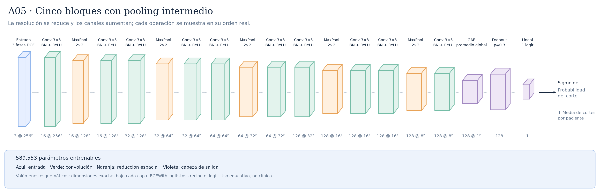

# A05 · Cinco bloques con pooling intermedio



Se añade un quinto bloque de 128 canales a A04/E05: Conv–BN–ReLU → MaxPool → Conv–BN–ReLU. Son diez convoluciones y cinco MaxPool, con resolución 256 → 128 → 64 → 32 → 16 → 8. No se amplía a 256 canales para no cambiar profundidad y anchura a la vez. Hipótesis: el bloque extra combina información de una región mayor antes del promedio global. El campo receptivo local aumenta de 106×106 a 218×218; es teórico, no una medida de atención ni una explicación causal. El riesgo es aumentar sobreajuste o perder detalle espacial. Se mantienen todos los ajustes de entrenamiento de E05, incluido learning rate inicial 0,001, BCE normal, seed 42, fold 0 y diez épocas. El scheduler puede reducir el learning rate durante el entrenamiento. Resultado científico pendiente; más capas no garantizan alcanzar ROC-AUC 0,7. Comparación y criterio de confirmación en [el protocolo](../PROTOCOLO_COMPARACION.md).

Total: **589.553 parámetros entrenables**.

Configuraciones asociadas:

- [E06_five_blocks_normal.json](../../configs/experiments/E06_five_blocks_normal.json)

## Recorrido de las capas

| Operación | Salida por corte | Parámetros de la operación | Detalle |
|---|---|---:|---|
| Entrada · 3 fases DCE | `(3, 256, 256)` | 0 | 3 fases temporales |
| Conv 3×3 · BN + ReLU | `(16, 256, 256)` | 432 | kernel=3, padding=1, stride=1 |
| MaxPool · 2×2 | `(16, 128, 128)` | 0 | kernel=2, padding=0, stride=2 |
| Conv 3×3 · BN + ReLU | `(16, 128, 128)` | 2304 | kernel=3, padding=1, stride=1 |
| Conv 3×3 · BN + ReLU | `(32, 128, 128)` | 4608 | kernel=3, padding=1, stride=1 |
| MaxPool · 2×2 | `(32, 64, 64)` | 0 | kernel=2, padding=0, stride=2 |
| Conv 3×3 · BN + ReLU | `(32, 64, 64)` | 9216 | kernel=3, padding=1, stride=1 |
| Conv 3×3 · BN + ReLU | `(64, 64, 64)` | 18432 | kernel=3, padding=1, stride=1 |
| MaxPool · 2×2 | `(64, 32, 32)` | 0 | kernel=2, padding=0, stride=2 |
| Conv 3×3 · BN + ReLU | `(64, 32, 32)` | 36864 | kernel=3, padding=1, stride=1 |
| Conv 3×3 · BN + ReLU | `(128, 32, 32)` | 73728 | kernel=3, padding=1, stride=1 |
| MaxPool · 2×2 | `(128, 16, 16)` | 0 | kernel=2, padding=0, stride=2 |
| Conv 3×3 · BN + ReLU | `(128, 16, 16)` | 147456 | kernel=3, padding=1, stride=1 |
| Conv 3×3 · BN + ReLU | `(128, 16, 16)` | 147456 | kernel=3, padding=1, stride=1 |
| MaxPool · 2×2 | `(128, 8, 8)` | 0 | kernel=2, padding=0, stride=2 |
| Conv 3×3 · BN + ReLU | `(128, 8, 8)` | 147456 | kernel=3, padding=1, stride=1 |
| GAP · promedio global | `(128, 1, 1)` | 0 | salida espacial=(1, 1) |
| Flatten | `(128,)` | 0 | reorganiza; sin pesos |
| Dropout · p=0.3 | `(128,)` | 0 | solo durante entrenamiento |
| Lineal · 1 logit | `(1,)` | 129 | 128 → 1 |

Las formas omiten el batch `B`. Los parámetros de BatchNorm se incluyen en el total, pero no en las filas de convolución.

Antes del promedio adaptativo, cada posición tiene un campo receptivo teórico de **218×218 píxeles**. El promedio combina posiciones espaciales; no equivale a localizar un tumor.

Las convoluciones tienen stride 1 y padding 1; cada MaxPool 2×2 tiene stride 2. ReLU aporta no linealidad. La sigmoide se aplica para evaluar, después del logit. La media de probabilidades por paciente es la agregación inicial, pendiente de selección con validación.

## Imágenes y regeneración

[SVG vectorial](arquitectura.svg) · [PNG](arquitectura.png). Las etiquetas y dimensiones se obtienen ejecutando la red con una entrada ficticia; no se leen imágenes de pacientes.

```bash
python -m src.document_architectures
```

Uso educativo y de investigación, sin validez clínica.
