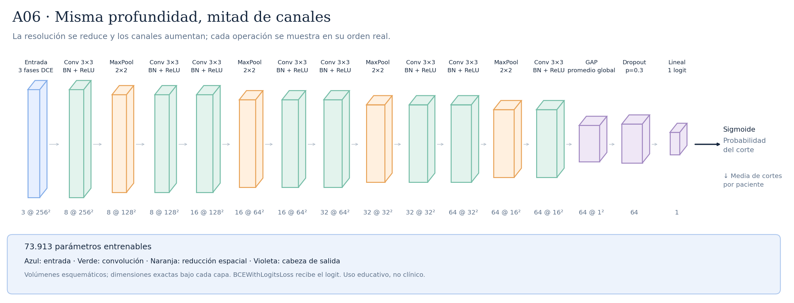

# A06 · Misma profundidad, mitad de canales



E10 mantiene el orden Conv–BN–ReLU → MaxPool → Conv–BN–ReLU de E05, pero reduce los canales de 16/32/64/128 a 8/16/32/64. Conserva ocho convoluciones y cuatro MaxPool, las resoluciones espaciales y el campo receptivo local de 106×106. La cabeza recibe 64 valores tras GAP y devuelve un logit. Reduce capacidad sin eliminar etapas de procesamiento: no es E04, que quitaba convoluciones. Hipótesis: menos parámetros pueden limitar la adaptación a peculiaridades de train; también podrían causar infraajuste. El diagnóstico de E05 muestra AUC train/validación 0,587/0,614 en época 1 y 0,870/0,580 en época 10. E10 conserva diez épocas, LR inicial 0,001, weight decay 0,0001, dropout 0,3, BCE normal, fold 0 y seed 42, sin aumentos. E10 completó diez épocas en Mac MPS: mejor época 6, ROC-AUC 0,590625 y AP 0,379061. E05 Mac obtuvo 0,586895: delta +0,003730 con IC pareado global que incluye cero, sin ventaja clara. Ver [protocolo y ejecución en Mac](../ANCHURA_E10.md).

Total: **73.913 parámetros entrenables**.

Configuraciones asociadas:

- [E10_half_width.json](../../configs/experiments/E10_half_width.json)

## Recorrido de las capas

| Operación | Salida por corte | Parámetros de la operación | Detalle |
|---|---|---:|---|
| Entrada · 3 fases DCE | `(3, 256, 256)` | 0 | 3 fases temporales |
| Conv 3×3 · BN + ReLU | `(8, 256, 256)` | 216 | kernel=3, padding=1, stride=1 |
| MaxPool · 2×2 | `(8, 128, 128)` | 0 | kernel=2, padding=0, stride=2 |
| Conv 3×3 · BN + ReLU | `(8, 128, 128)` | 576 | kernel=3, padding=1, stride=1 |
| Conv 3×3 · BN + ReLU | `(16, 128, 128)` | 1152 | kernel=3, padding=1, stride=1 |
| MaxPool · 2×2 | `(16, 64, 64)` | 0 | kernel=2, padding=0, stride=2 |
| Conv 3×3 · BN + ReLU | `(16, 64, 64)` | 2304 | kernel=3, padding=1, stride=1 |
| Conv 3×3 · BN + ReLU | `(32, 64, 64)` | 4608 | kernel=3, padding=1, stride=1 |
| MaxPool · 2×2 | `(32, 32, 32)` | 0 | kernel=2, padding=0, stride=2 |
| Conv 3×3 · BN + ReLU | `(32, 32, 32)` | 9216 | kernel=3, padding=1, stride=1 |
| Conv 3×3 · BN + ReLU | `(64, 32, 32)` | 18432 | kernel=3, padding=1, stride=1 |
| MaxPool · 2×2 | `(64, 16, 16)` | 0 | kernel=2, padding=0, stride=2 |
| Conv 3×3 · BN + ReLU | `(64, 16, 16)` | 36864 | kernel=3, padding=1, stride=1 |
| GAP · promedio global | `(64, 1, 1)` | 0 | salida espacial=(1, 1) |
| Flatten | `(64,)` | 0 | reorganiza; sin pesos |
| Dropout · p=0.3 | `(64,)` | 0 | solo durante entrenamiento |
| Lineal · 1 logit | `(1,)` | 65 | 64 → 1 |

Las formas omiten el batch `B`. Los parámetros de BatchNorm se incluyen en el total, pero no en las filas de convolución.

Antes del promedio adaptativo, cada posición tiene un campo receptivo teórico de **106×106 píxeles**. El promedio combina posiciones espaciales; no equivale a localizar un tumor.

Las convoluciones tienen stride 1 y padding 1; cada MaxPool 2×2 tiene stride 2. ReLU aporta no linealidad. La sigmoide se aplica para evaluar, después del logit. La media de probabilidades por paciente es la agregación inicial, pendiente de selección con validación.

## Imágenes y regeneración

[SVG vectorial](arquitectura.svg) · [PNG](arquitectura.png). Las etiquetas y dimensiones se obtienen ejecutando la red con una entrada ficticia; no se leen imágenes de pacientes.

```bash
python -m src.document_architectures
```

Uso educativo y de investigación, sin validez clínica.
