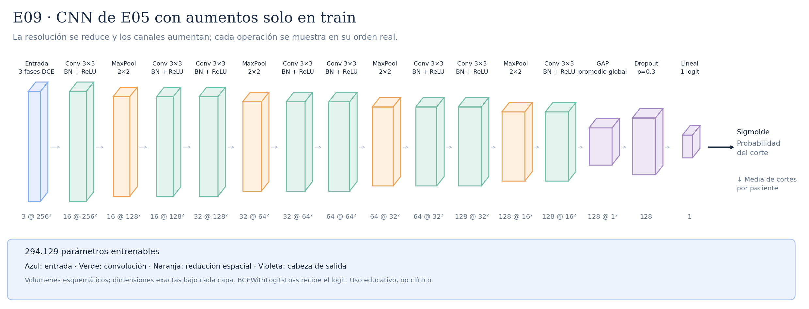

# E09 · CNN de E05 con aumentos solo en train



La CNN es exactamente A04/E05: ocho convoluciones, cuatro MaxPool y dropout 0,3. El único cambio es un aumento aleatorio de entrada durante entrenamiento: rotaciones entre −5° y +5° y traslaciones de hasta 3 % por eje (7,68 píxeles). Se aplica una única rejilla bilineal a PRE/EARLY/LATE, con relleno cero; no se normalizan las fases por separado. No se crean pacientes nuevas ni se guardan PNG aumentados. Validación, test e inferencia no aplican el aumento; mantienen la misma carga determinista en [0,1]. El presupuesto sigue siendo diez épocas, LR inicial 0,001, weight decay 0,0001, BCE normal, fold 0 y seed 42. Hipótesis: aprender patrones menos dependientes de la posición. Puede empeorar si pierde detalle; no se garantiza reducir el sobreajuste ni alcanzar ROC-AUC 0,7. E09 completó diez épocas en universidad: mejor época 1, ROC-AUC 0,610282 y AP 0,375773; no superó el resultado observado de E05. Ver [protocolo y lámina local](../AUMENTOS_E09.md).

Total: **294.129 parámetros entrenables**.

Configuraciones asociadas:

- [E09_shared_affine.json](../../configs/experiments/E09_shared_affine.json)

## Recorrido de las capas

| Operación | Salida por corte | Parámetros de la operación | Detalle |
|---|---|---:|---|
| Entrada · 3 fases DCE | `(3, 256, 256)` | 0 | 3 fases temporales |
| Conv 3×3 · BN + ReLU | `(16, 256, 256)` | 432 | kernel=3, padding=1, stride=1 |
| MaxPool · 2×2 | `(16, 128, 128)` | 0 | kernel=2, padding=0, stride=2 |
| Conv 3×3 · BN + ReLU | `(16, 128, 128)` | 2304 | kernel=3, padding=1, stride=1 |
| Conv 3×3 · BN + ReLU | `(32, 128, 128)` | 4608 | kernel=3, padding=1, stride=1 |
| MaxPool · 2×2 | `(32, 64, 64)` | 0 | kernel=2, padding=0, stride=2 |
| Conv 3×3 · BN + ReLU | `(32, 64, 64)` | 9216 | kernel=3, padding=1, stride=1 |
| Conv 3×3 · BN + ReLU | `(64, 64, 64)` | 18432 | kernel=3, padding=1, stride=1 |
| MaxPool · 2×2 | `(64, 32, 32)` | 0 | kernel=2, padding=0, stride=2 |
| Conv 3×3 · BN + ReLU | `(64, 32, 32)` | 36864 | kernel=3, padding=1, stride=1 |
| Conv 3×3 · BN + ReLU | `(128, 32, 32)` | 73728 | kernel=3, padding=1, stride=1 |
| MaxPool · 2×2 | `(128, 16, 16)` | 0 | kernel=2, padding=0, stride=2 |
| Conv 3×3 · BN + ReLU | `(128, 16, 16)` | 147456 | kernel=3, padding=1, stride=1 |
| GAP · promedio global | `(128, 1, 1)` | 0 | salida espacial=(1, 1) |
| Flatten | `(128,)` | 0 | reorganiza; sin pesos |
| Dropout · p=0.3 | `(128,)` | 0 | solo durante entrenamiento |
| Lineal · 1 logit | `(1,)` | 129 | 128 → 1 |

Las formas omiten el batch `B`. Los parámetros de BatchNorm se incluyen en el total, pero no en las filas de convolución.

Antes del promedio adaptativo, cada posición tiene un campo receptivo teórico de **106×106 píxeles**. El promedio combina posiciones espaciales; no equivale a localizar un tumor.

Las convoluciones tienen stride 1 y padding 1; cada MaxPool 2×2 tiene stride 2. ReLU aporta no linealidad. La sigmoide se aplica para evaluar, después del logit. La media de probabilidades por paciente es la agregación inicial, pendiente de selección con validación.

## Imágenes y regeneración

[SVG vectorial](arquitectura.svg) · [PNG](arquitectura.png). Las etiquetas y dimensiones se obtienen ejecutando la red con una entrada ficticia; no se leen imágenes de pacientes.

```bash
python -m src.document_architectures
```

Uso educativo y de investigación, sin validez clínica.
