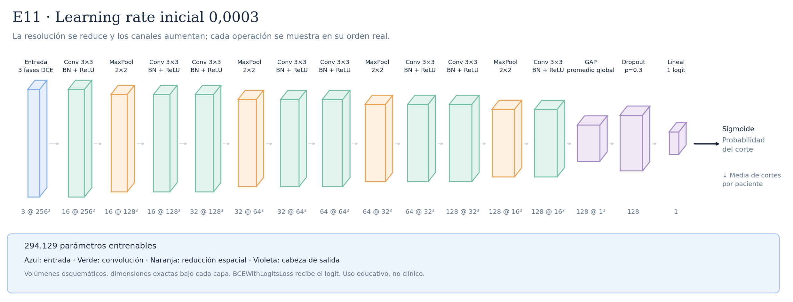

# E11 · Learning rate inicial 0,0003



La arquitectura es A04/E05: cuatro bloques Conv–BN–ReLU → MaxPool → Conv–BN–ReLU, canales 16/32/64/128 y 294.129 parámetros. El único ajuste modificado respecto a E05 Mac es el learning rate inicial de AdamW: 0,001 → 0,0003. No es una capa ni un cambio en los kernels. Se mantienen diez épocas y el scheduler, que puede reducir la tasa según AUC de validación. Hipótesis: actualizaciones menores podrían estabilizar aprendizaje; también podrían necesitar más épocas. E11 completó diez épocas en Mac MPS: mejor época 2, ROC-AUC 0,550202 y AP 0,344140; 399,15 segundos. No superó el ROC-AUC de E05 Mac (0,586895) y mantuvo señales de sobreajuste. Ver [protocolo de learning rate](../LEARNING_RATE.md).

Total: **294.129 parámetros entrenables**.

Configuraciones asociadas:

- [E11_lr_0003.json](../../configs/experiments/E11_lr_0003.json)

## Recorrido de las capas

| Operación | Salida por corte | Parámetros de la operación | Detalle |
|---|---|---:|---|
| Entrada · 3 fases DCE | `(3, 256, 256)` | 0 | 3 fases temporales |
| Conv 3×3 · BN + ReLU | `(16, 256, 256)` | 432 | kernel=3, padding=1, stride=1 |
| MaxPool · 2×2 | `(16, 128, 128)` | 0 | kernel=2, padding=0, stride=2 |
| Conv 3×3 · BN + ReLU | `(16, 128, 128)` | 2304 | kernel=3, padding=1, stride=1 |
| Conv 3×3 · BN + ReLU | `(32, 128, 128)` | 4608 | kernel=3, padding=1, stride=1 |
| MaxPool · 2×2 | `(32, 64, 64)` | 0 | kernel=2, padding=0, stride=2 |
| Conv 3×3 · BN + ReLU | `(32, 64, 64)` | 9216 | kernel=3, padding=1, stride=1 |
| Conv 3×3 · BN + ReLU | `(64, 64, 64)` | 18432 | kernel=3, padding=1, stride=1 |
| MaxPool · 2×2 | `(64, 32, 32)` | 0 | kernel=2, padding=0, stride=2 |
| Conv 3×3 · BN + ReLU | `(64, 32, 32)` | 36864 | kernel=3, padding=1, stride=1 |
| Conv 3×3 · BN + ReLU | `(128, 32, 32)` | 73728 | kernel=3, padding=1, stride=1 |
| MaxPool · 2×2 | `(128, 16, 16)` | 0 | kernel=2, padding=0, stride=2 |
| Conv 3×3 · BN + ReLU | `(128, 16, 16)` | 147456 | kernel=3, padding=1, stride=1 |
| GAP · promedio global | `(128, 1, 1)` | 0 | salida espacial=(1, 1) |
| Flatten | `(128,)` | 0 | reorganiza; sin pesos |
| Dropout · p=0.3 | `(128,)` | 0 | solo durante entrenamiento |
| Lineal · 1 logit | `(1,)` | 129 | 128 → 1 |

Las formas omiten el batch `B`. Los parámetros de BatchNorm se incluyen en el total, pero no en las filas de convolución.

Antes del promedio adaptativo, cada posición tiene un campo receptivo teórico de **106×106 píxeles**. El promedio combina posiciones espaciales; no equivale a localizar un tumor.

Las convoluciones tienen stride 1 y padding 1; cada MaxPool 2×2 tiene stride 2. ReLU aporta no linealidad. La sigmoide se aplica para evaluar, después del logit. La media de probabilidades por paciente es la agregación inicial, pendiente de selección con validación.

## Imágenes y regeneración

[SVG vectorial](arquitectura.svg) · [PNG](arquitectura.png). Las etiquetas y dimensiones se obtienen ejecutando la red con una entrada ficticia; no se leen imágenes de pacientes.

```bash
python -m src.document_architectures
```

Uso educativo y de investigación, sin validez clínica.
