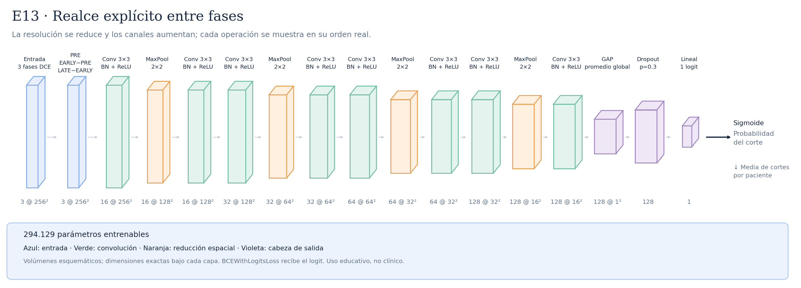

# E13 · Realce explícito entre fases



La entrada externa sigue siendo PRE/EARLY/LATE en [0,1], con forma [3,256,256]. Dentro del modelo una operación fija conserva PRE y calcula EARLY−PRE y LATE−EARLY: tres canales, cero parámetros nuevos y sin recortar negativos. Las ocho convoluciones, cuatro MaxPool, BatchNorm, GAP y dropout son los de A04/E05; total 294.129 parámetros y campo receptivo local 106×106. Se conserva LR inicial 0,001 y todos los ajustes de E05 Mac. Es un cambio de representación invertible, no información nueva ni una CNN más grande: EARLY=PRE+(EARLY−PRE), LATE=EARLY+(LATE−EARLY). Hipótesis: presentar directamente los cambios temporales podría facilitar optimización. La primera convolución original ya podría aprender restas, por lo que no hay mejora garantizada. Las escalas/correlaciones de entrada cambian y pueden afectar la optimización y BatchNorm; esto forma parte del experimento. E13 completó diez épocas en Mac MPS: mejor época 10, ROC-AUC 0,572480 y AP 0,350860; 421,48 segundos. No supera la referencia E05 Mac (ROC-AUC 0,586895). El mejor checkpoint al final no demuestra convergencia ni que más épocas ayuden; revisar diagnóstico train/validación antes de decidir. Ver [protocolo E13](../REALCE_E13.md).

Total: **294.129 parámetros entrenables**.

Configuraciones asociadas:

- [E13_phase_differences.json](../../configs/experiments/E13_phase_differences.json)

## Recorrido de las capas

| Operación | Salida por corte | Parámetros de la operación | Detalle |
|---|---|---:|---|
| Entrada · 3 fases DCE | `(3, 256, 256)` | 0 | 3 fases temporales |
| PRE · EARLY−PRE · LATE−EARLY | `(3, 256, 256)` | 0 | restas fijas; sin clipping, pesos, kernel ni cambio espacial |
| Conv 3×3 · BN + ReLU | `(16, 256, 256)` | 432 | kernel=3, padding=1, stride=1 |
| MaxPool · 2×2 | `(16, 128, 128)` | 0 | kernel=2, padding=0, stride=2 |
| Conv 3×3 · BN + ReLU | `(16, 128, 128)` | 2304 | kernel=3, padding=1, stride=1 |
| Conv 3×3 · BN + ReLU | `(32, 128, 128)` | 4608 | kernel=3, padding=1, stride=1 |
| MaxPool · 2×2 | `(32, 64, 64)` | 0 | kernel=2, padding=0, stride=2 |
| Conv 3×3 · BN + ReLU | `(32, 64, 64)` | 9216 | kernel=3, padding=1, stride=1 |
| Conv 3×3 · BN + ReLU | `(64, 64, 64)` | 18432 | kernel=3, padding=1, stride=1 |
| MaxPool · 2×2 | `(64, 32, 32)` | 0 | kernel=2, padding=0, stride=2 |
| Conv 3×3 · BN + ReLU | `(64, 32, 32)` | 36864 | kernel=3, padding=1, stride=1 |
| Conv 3×3 · BN + ReLU | `(128, 32, 32)` | 73728 | kernel=3, padding=1, stride=1 |
| MaxPool · 2×2 | `(128, 16, 16)` | 0 | kernel=2, padding=0, stride=2 |
| Conv 3×3 · BN + ReLU | `(128, 16, 16)` | 147456 | kernel=3, padding=1, stride=1 |
| GAP · promedio global | `(128, 1, 1)` | 0 | salida espacial=(1, 1) |
| Flatten | `(128,)` | 0 | reorganiza; sin pesos |
| Dropout · p=0.3 | `(128,)` | 0 | solo durante entrenamiento |
| Lineal · 1 logit | `(1,)` | 129 | 128 → 1 |

Las formas omiten el batch `B`. Los parámetros de BatchNorm se incluyen en el total, pero no en las filas de convolución.

Antes del promedio adaptativo, cada posición tiene un campo receptivo teórico de **106×106 píxeles**. El promedio combina posiciones espaciales; no equivale a localizar un tumor.

Las convoluciones tienen stride 1 y padding 1; cada MaxPool 2×2 tiene stride 2. ReLU aporta no linealidad. La sigmoide se aplica para evaluar, después del logit. La media de probabilidades por paciente es la agregación inicial, pendiente de selección con validación.

## Imágenes y regeneración

[SVG vectorial](arquitectura.svg) · [PNG](arquitectura.png). Las etiquetas y dimensiones se obtienen ejecutando la red con una entrada ficticia; no se leen imágenes de pacientes.

```bash
python -m src.document_architectures
```

Uso educativo y de investigación, sin validez clínica.
