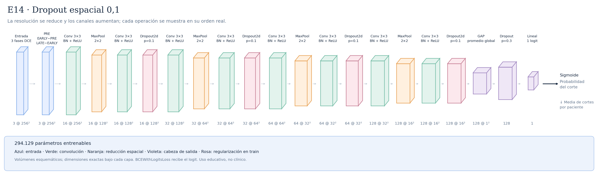

# E14 · Dropout espacial 0,1



Variante controlada de E13_50epochs: tras la segunda Conv–BN–ReLU de cada bloque se añade Dropout2d con p=0,1. Durante entrenamiento anula aleatoriamente mapas aprendidos completos por muestra y escala los supervivientes por 1/(1−p); en evaluación no anula ninguno. No se borran fases PRE/EARLY/LATE ni se modifica la imagen. Conserva ocho convoluciones, cuatro pools intermedios, 294.129 parámetros y campo receptivo local 106×106. Hipótesis: limitar la dependencia de mapas concretos podría mejorar generalización; también podría causar infraajuste. La forma de salida del bloque no cambia. Se conserva dropout final 0,3, diferencias firmadas, batch 16, LR inicial 0,001, weight decay 0,0001, BCE normal, seed 42, fold 0, 50 épocas y paciencia 51. No tiene resultados científicos todavía; comparar con E13_50epochs en el mismo dispositivo y precisión. Ver [protocolo de comparación](../DROPOUT_ESPACIAL.md).

Total: **294.129 parámetros entrenables**.

Configuraciones asociadas:

- [E14_spatial_dropout_010.json](../../configs/experiments/E14_spatial_dropout_010.json)

## Recorrido de las capas

| Operación | Salida por corte | Parámetros de la operación | Detalle |
|---|---|---:|---|
| Entrada · 3 fases DCE | `(3, 256, 256)` | 0 | 3 fases temporales |
| PRE · EARLY−PRE · LATE−EARLY | `(3, 256, 256)` | 0 | restas fijas; sin clipping, pesos, kernel ni cambio espacial |
| Conv 3×3 · BN + ReLU | `(16, 256, 256)` | 432 | kernel=3, padding=1, stride=1 |
| MaxPool · 2×2 | `(16, 128, 128)` | 0 | kernel=2, padding=0, stride=2 |
| Conv 3×3 · BN + ReLU | `(16, 128, 128)` | 2304 | kernel=3, padding=1, stride=1 |
| Dropout2d · p=0.1 | `(16, 128, 128)` | 0 | mapas completos por muestra; solo train; sin pesos ni cambio espacial |
| Conv 3×3 · BN + ReLU | `(32, 128, 128)` | 4608 | kernel=3, padding=1, stride=1 |
| MaxPool · 2×2 | `(32, 64, 64)` | 0 | kernel=2, padding=0, stride=2 |
| Conv 3×3 · BN + ReLU | `(32, 64, 64)` | 9216 | kernel=3, padding=1, stride=1 |
| Dropout2d · p=0.1 | `(32, 64, 64)` | 0 | mapas completos por muestra; solo train; sin pesos ni cambio espacial |
| Conv 3×3 · BN + ReLU | `(64, 64, 64)` | 18432 | kernel=3, padding=1, stride=1 |
| MaxPool · 2×2 | `(64, 32, 32)` | 0 | kernel=2, padding=0, stride=2 |
| Conv 3×3 · BN + ReLU | `(64, 32, 32)` | 36864 | kernel=3, padding=1, stride=1 |
| Dropout2d · p=0.1 | `(64, 32, 32)` | 0 | mapas completos por muestra; solo train; sin pesos ni cambio espacial |
| Conv 3×3 · BN + ReLU | `(128, 32, 32)` | 73728 | kernel=3, padding=1, stride=1 |
| MaxPool · 2×2 | `(128, 16, 16)` | 0 | kernel=2, padding=0, stride=2 |
| Conv 3×3 · BN + ReLU | `(128, 16, 16)` | 147456 | kernel=3, padding=1, stride=1 |
| Dropout2d · p=0.1 | `(128, 16, 16)` | 0 | mapas completos por muestra; solo train; sin pesos ni cambio espacial |
| GAP · promedio global | `(128, 1, 1)` | 0 | salida espacial=(1, 1) |
| Flatten | `(128,)` | 0 | reorganiza; sin pesos |
| Dropout · p=0.3 | `(128,)` | 0 | solo durante entrenamiento |
| Lineal · 1 logit | `(1,)` | 129 | 128 → 1 |

Las formas omiten el batch `B`. Los parámetros de BatchNorm se incluyen en el total, pero no en las filas de convolución.

Antes del promedio adaptativo, cada posición tiene un campo receptivo teórico de **106×106 píxeles**. El promedio combina posiciones espaciales; no equivale a localizar un tumor.

Las convoluciones tienen stride 1 y padding 1; cada MaxPool 2×2 tiene stride 2. ReLU aporta no linealidad. La sigmoide se aplica para evaluar, después del logit. La media de probabilidades por paciente es la agregación inicial, pendiente de selección con validación.

## Imágenes y regeneración

[SVG vectorial](arquitectura.svg) · [PNG](arquitectura.png). Las etiquetas y dimensiones se obtienen ejecutando la red con una entrada ficticia; no se leen imágenes de pacientes.

```bash
python -m src.document_architectures --only E14_spatial_dropout_010
```

Este comando no regenera otras fichas. Los SVG tienen identificadores estables y no incluyen fechas de generación.

Uso educativo y de investigación, sin validez clínica.
