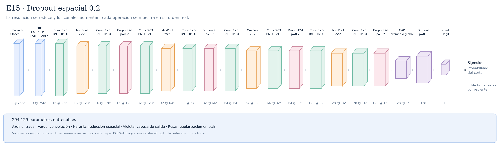

# E15 · Dropout espacial 0,2



Misma arquitectura de E14 con p=0,2 en los cuatro Dropout2d. Respecto a E13_50epochs solo cambia spatial_dropout de 0 a 0,2; respecto a E14 cambia solo su intensidad. No se eliminan canales de forma permanente ni se añaden parámetros. Cada bloque conserva dimensiones, kernel, padding, stride y campo receptivo. Busca comprobar si una regularización moderada evita depender de pocos mapas; no hay mejora garantizada. Se mantienen todos los ajustes de E13_50epochs, incluyendo dropout final 0,3, 50 épocas, paciencia 51 y selección por ROC-AUC por paciente. No hay resultados científicos todavía; primero probar E14, no lanzar ambos en paralelo al entrenamiento actual. Ver [protocolo](../DROPOUT_ESPACIAL.md).

Total: **294.129 parámetros entrenables**.

Configuraciones asociadas:

- [E15_spatial_dropout_020.json](../../configs/experiments/E15_spatial_dropout_020.json)

## Recorrido de las capas

| Operación | Salida por corte | Parámetros de la operación | Detalle |
|---|---|---:|---|
| Entrada · 3 fases DCE | `(3, 256, 256)` | 0 | 3 fases temporales |
| PRE · EARLY−PRE · LATE−EARLY | `(3, 256, 256)` | 0 | restas fijas; sin clipping, pesos, kernel ni cambio espacial |
| Conv 3×3 · BN + ReLU | `(16, 256, 256)` | 432 | kernel=3, padding=1, stride=1 |
| MaxPool · 2×2 | `(16, 128, 128)` | 0 | kernel=2, padding=0, stride=2 |
| Conv 3×3 · BN + ReLU | `(16, 128, 128)` | 2304 | kernel=3, padding=1, stride=1 |
| Dropout2d · p=0.2 | `(16, 128, 128)` | 0 | mapas completos por muestra; solo train; sin pesos ni cambio espacial |
| Conv 3×3 · BN + ReLU | `(32, 128, 128)` | 4608 | kernel=3, padding=1, stride=1 |
| MaxPool · 2×2 | `(32, 64, 64)` | 0 | kernel=2, padding=0, stride=2 |
| Conv 3×3 · BN + ReLU | `(32, 64, 64)` | 9216 | kernel=3, padding=1, stride=1 |
| Dropout2d · p=0.2 | `(32, 64, 64)` | 0 | mapas completos por muestra; solo train; sin pesos ni cambio espacial |
| Conv 3×3 · BN + ReLU | `(64, 64, 64)` | 18432 | kernel=3, padding=1, stride=1 |
| MaxPool · 2×2 | `(64, 32, 32)` | 0 | kernel=2, padding=0, stride=2 |
| Conv 3×3 · BN + ReLU | `(64, 32, 32)` | 36864 | kernel=3, padding=1, stride=1 |
| Dropout2d · p=0.2 | `(64, 32, 32)` | 0 | mapas completos por muestra; solo train; sin pesos ni cambio espacial |
| Conv 3×3 · BN + ReLU | `(128, 32, 32)` | 73728 | kernel=3, padding=1, stride=1 |
| MaxPool · 2×2 | `(128, 16, 16)` | 0 | kernel=2, padding=0, stride=2 |
| Conv 3×3 · BN + ReLU | `(128, 16, 16)` | 147456 | kernel=3, padding=1, stride=1 |
| Dropout2d · p=0.2 | `(128, 16, 16)` | 0 | mapas completos por muestra; solo train; sin pesos ni cambio espacial |
| GAP · promedio global | `(128, 1, 1)` | 0 | salida espacial=(1, 1) |
| Flatten | `(128,)` | 0 | reorganiza; sin pesos |
| Dropout · p=0.3 | `(128,)` | 0 | solo durante entrenamiento |
| Lineal · 1 logit | `(1,)` | 129 | 128 → 1 |

Las formas omiten el batch `B`. Los parámetros de BatchNorm se incluyen en el total, pero no en las filas de convolución.

Antes del promedio adaptativo, cada posición tiene un campo receptivo teórico de **106×106 píxeles**. El promedio combina posiciones espaciales; no equivale a localizar un tumor.

Las convoluciones tienen stride 1 y padding 1; cada MaxPool 2×2 tiene stride 2. ReLU aporta no linealidad. La sigmoide se aplica para evaluar, después del logit. La media de probabilidades por paciente es la agregación inicial, pendiente de selección con validación.

## Imágenes y regeneración

[SVG vectorial](arquitectura.svg) · [PNG](arquitectura.png). Las etiquetas y dimensiones se obtienen ejecutando la red con una entrada ficticia; no se leen imágenes de pacientes.

```bash
python -m src.document_architectures --only E15_spatial_dropout_020
```

Este comando no regenera otras fichas. Los SVG tienen identificadores estables y no incluyen fechas de generación.

Uso educativo y de investigación, sin validez clínica.
