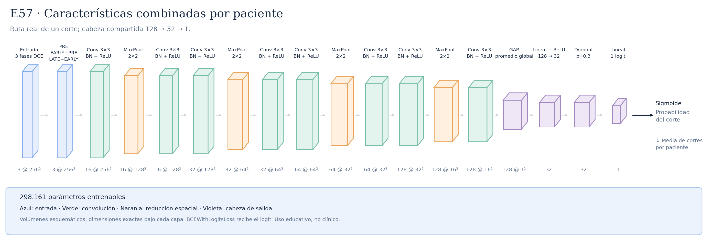
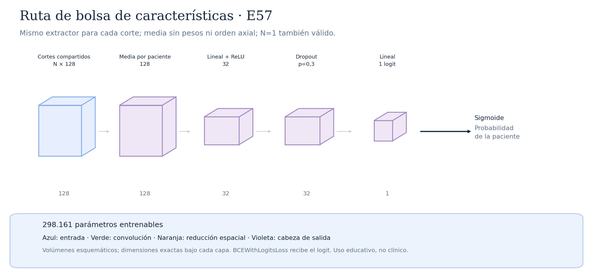

# E57 · Características combinadas por paciente



CNN propia desde cero compartida entre cortes. Ocho convoluciones3×3/padding1/stride1, canales16/32/64/128, ocho BN/ReLU y cuatro MaxPool2×2 intermedios. GAP128 y cabeza Linear128→32(4128 parámetros)→ReLU→Dropout0,3→Linear32→1(33). Extractor294000, total298161, RF local106. [Protocolo y restricciones](../CARACTERISTICAS_PACIENTE.md). Cambios frente E19: cabeza, pérdida/lotes por paciente y agregación; no aislarlos. Solo E57−E56 compara punto de agregación con misma cabeza y lotes. La granularidad del dropout cambia necesariamente con ese punto. Esta figura es la ruta de un corte: no representa diez cortes en serie. Pendiente científico; mantener test cerrado. Los checkpoints nuevos requieren load_feature_checkpoint; NO son intercambiables con el cargador web actual.

Total: **298.161 parámetros entrenables**.

Configuraciones asociadas:

- [../patient_features/E57_patient_feature_mean_mac.json](../../configs/experiments/../patient_features/E57_patient_feature_mean_mac.json)

## Recorrido de las capas

| Operación | Salida por corte | Parámetros de la operación | Detalle |
|---|---|---:|---|
| Entrada · 3 fases DCE | `(3, 256, 256)` | 0 | 3 fases temporales |
| PRE · EARLY−PRE · LATE−EARLY | `(3, 256, 256)` | 0 | restas fijas; sin clipping, pesos, kernel ni cambio espacial |
| Conv 3×3 | `(16, 256, 256)` | 432 | kernel=3, padding=1, stride=1 |
| BatchNorm2d | `(16, 256, 256)` | 32 | estadísticas por lote en train; acumuladas en eval |
| ReLU | `(16, 256, 256)` | 0 | max(0, x); sin pesos ni cambio de forma |
| MaxPool · 2×2 | `(16, 128, 128)` | 0 | kernel=2, padding=0, stride=2 |
| Conv 3×3 | `(16, 128, 128)` | 2304 | kernel=3, padding=1, stride=1 |
| BatchNorm2d | `(16, 128, 128)` | 32 | estadísticas por lote en train; acumuladas en eval |
| ReLU | `(16, 128, 128)` | 0 | max(0, x); sin pesos ni cambio de forma |
| Conv 3×3 | `(32, 128, 128)` | 4608 | kernel=3, padding=1, stride=1 |
| BatchNorm2d | `(32, 128, 128)` | 64 | estadísticas por lote en train; acumuladas en eval |
| ReLU | `(32, 128, 128)` | 0 | max(0, x); sin pesos ni cambio de forma |
| MaxPool · 2×2 | `(32, 64, 64)` | 0 | kernel=2, padding=0, stride=2 |
| Conv 3×3 | `(32, 64, 64)` | 9216 | kernel=3, padding=1, stride=1 |
| BatchNorm2d | `(32, 64, 64)` | 64 | estadísticas por lote en train; acumuladas en eval |
| ReLU | `(32, 64, 64)` | 0 | max(0, x); sin pesos ni cambio de forma |
| Conv 3×3 | `(64, 64, 64)` | 18432 | kernel=3, padding=1, stride=1 |
| BatchNorm2d | `(64, 64, 64)` | 128 | estadísticas por lote en train; acumuladas en eval |
| ReLU | `(64, 64, 64)` | 0 | max(0, x); sin pesos ni cambio de forma |
| MaxPool · 2×2 | `(64, 32, 32)` | 0 | kernel=2, padding=0, stride=2 |
| Conv 3×3 | `(64, 32, 32)` | 36864 | kernel=3, padding=1, stride=1 |
| BatchNorm2d | `(64, 32, 32)` | 128 | estadísticas por lote en train; acumuladas en eval |
| ReLU | `(64, 32, 32)` | 0 | max(0, x); sin pesos ni cambio de forma |
| Conv 3×3 | `(128, 32, 32)` | 73728 | kernel=3, padding=1, stride=1 |
| BatchNorm2d | `(128, 32, 32)` | 256 | estadísticas por lote en train; acumuladas en eval |
| ReLU | `(128, 32, 32)` | 0 | max(0, x); sin pesos ni cambio de forma |
| MaxPool · 2×2 | `(128, 16, 16)` | 0 | kernel=2, padding=0, stride=2 |
| Conv 3×3 | `(128, 16, 16)` | 147456 | kernel=3, padding=1, stride=1 |
| BatchNorm2d | `(128, 16, 16)` | 256 | estadísticas por lote en train; acumuladas en eval |
| ReLU | `(128, 16, 16)` | 0 | max(0, x); sin pesos ni cambio de forma |
| GAP · promedio global | `(128, 1, 1)` | 0 | salida espacial=(1, 1) |
| Flatten | `(128,)` | 0 | reorganiza; sin pesos |
| Lineal + ReLU · 128 → 32 | `(32,)` | 4128 | 128 → 32 |
| ReLU | `(32,)` | 0 | max(0, x); sin pesos ni cambio de forma |
| Dropout · p=0.3 | `(32,)` | 0 | solo durante entrenamiento |
| Lineal · 1 logit | `(1,)` | 33 | 32 → 1 |

Las formas omiten el batch `B`. Las filas de normalización incluyen sus parámetros propios; en el dibujo se agrupan con Conv y ReLU.

Antes del pooling global, el campo receptivo **convolucional local** es **106×106 píxeles**. Este cálculo sigue kernels y strides; no incorpora la dependencia espacial global de las estadísticas de normalización. El pooling global combina posiciones; no equivale a localizar un tumor.

Convoluciones del extractor: kernel 3×3, padding 1, stride 1; cada MaxPool 2×2 tiene stride 2. ReLU aporta no linealidad. La sigmoide de salida se aplica para evaluar, después del logit. La media de probabilidades por paciente es la agregación de estas pruebas, elegida en desarrollo; test no se utiliza para ajustarla.

## Imágenes y regeneración

[SVG vectorial](arquitectura.svg) · [PNG](arquitectura.png). Las etiquetas y dimensiones se obtienen ejecutando la red con una entrada ficticia; no se leen imágenes de pacientes.

```bash
python -m src.document_architectures --only E57_patient_feature_mean_mac
```

Este comando no regenera otras fichas. Los SVG tienen identificadores estables y no incluyen fechas de generación.

Uso educativo y de investigación, sin validez clínica.

## Ruta alternativa de bolsa



[SVG bolsa](bolsa.svg). La bolsa se usa en train SOLO en E57; en E56 es diagnóstico secundario. La media no aprende interacciones por pares ni orden axial. No tiene kernel/padding/stride; combina N vectores128→1 vector128. N=1 es idéntico al forward por corte en eval.
